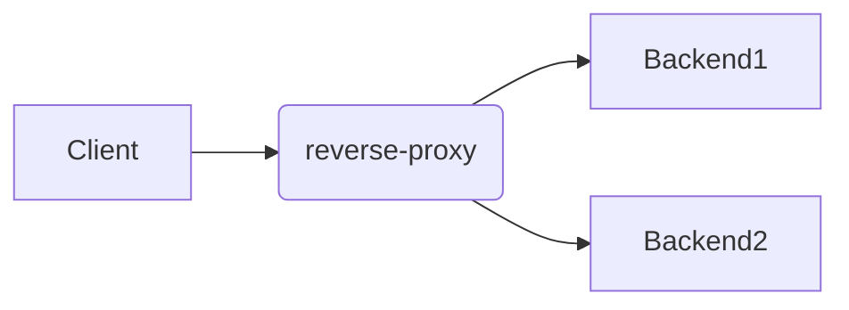
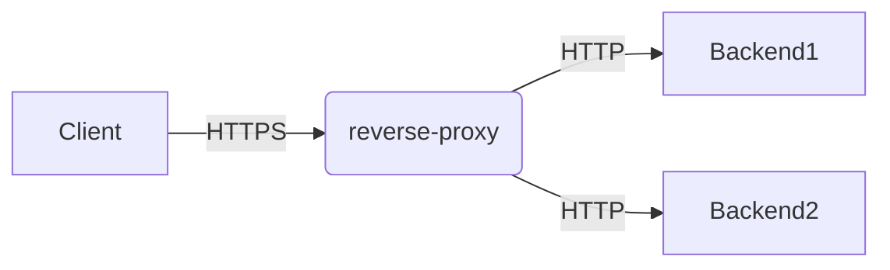

# tp-reverse-proxy-correction
A reverse proxy doing load balancing to backends

# Flow
Create a simple reverse-proxy to dispatch requests to either of N instances of the backends (previous app).

# Routing setup
- run 2 instances of the TP cats app in parallel using `docker compose`
- Create a http handler using the standart lib's `httputil.NewSingleHostReverseProxy`, each pointing to docker compose backend service
- Create a main http handler matching path `/` and calling backend handler

# Manipulations

- send requests to the reverse proxy, observe they reach one of the backend service instance
- observe they always reach the same instance
- stop one of the backends
- observe the new requests get routed to the other instance
- Use HTTPS for connections between the client and the reverse-proxy and still HTTP for the backends

